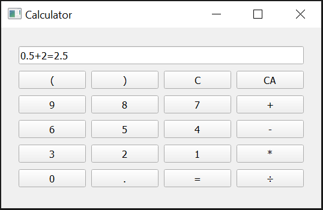

# Calculator
### About the app
A simple calculator with four operatorations inclunding addition, subtraction, multiplication and division. In addition, it also works with decimals and brackets. Furthermore, we can clear all characters on the screen or just clear one character, and it can handle errors when there are mistakes in the operations.

### Screenshot
This is how the app looks like:

### Try it!
You can download the game (Calculator.zip)from [Release](https://github.com/socolachaymo/Calculator/releases/tag/0.0) and run the calculator.exe file
